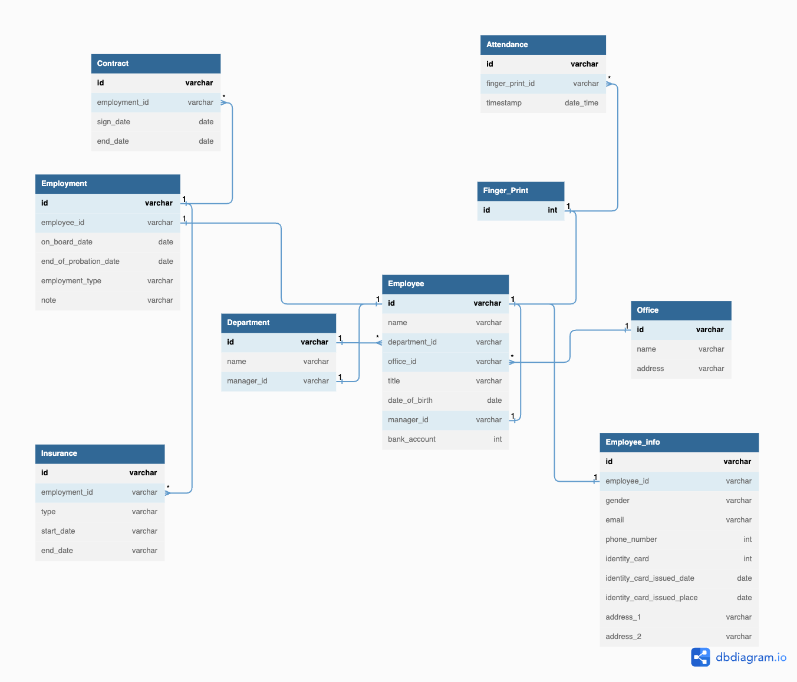
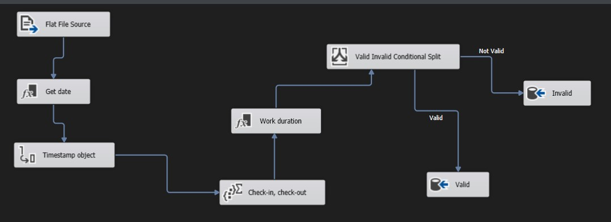

# HR data warehouse project
In this project, I want to create a BI solution for the HR department in a cosmetic hospital. The solution helps the HR department to easily access the required data and supports the department in reviewing the performance of employees easily. 

## 1. Get the data from the HR department. 
The HR department manages the employees using a spreadsheet. In the spreadsheet:
- [Employees](https://docs.google.com/spreadsheets/d/1DJYTOcLgxjPA6KuPBIxC4kz67pX6i5E1KOzKzdORkYk/edit#gid=716097444) stores all the information about the employees. 
- [Attendance](https://docs.google.com/spreadsheets/d/1DJYTOcLgxjPA6KuPBIxC4kz67pX6i5E1KOzKzdORkYk/edit#gid=1114897994) stores all the attendance information of the employees. 

## 2. Database schema

### Entities: 
- Department
- Employee
- Employment
- Finger Print
- Office
- Contract
- Insurance
- Attendance 

A graph was created to show [the data model](https://dbdiagram.io/d/64574475dca9fb07c4a301cd)




## 3. Create the database in Microsoft SQL Server from the raw Excel file. 
1. Create a new database in Microsoft SQL Server Management Studio (SSMS): ```HR_db```.
2. Import the raw data table. Import the excel file to the HR_db. Two tables are created: ```dbo.Attendance$``` and ```dbo.Employee$``` 
3. Using the database schema in section 2, create a script to create tables and insert data from the raw tables.
```sql
   USE [HR_db] 
   -- Create the Department table
   CREATE TABLE Department (
      id varchar(20) PRIMARY KEY, 
      name varchar(50),
      manager_id varchar(20)
   )
   GO
   
   --Insert data into Department table
   INSERT INTO [dbo].[Department] ([id],[name],[manager_id]) 
   VALUES ("SUR","Surgeon",NULL),
          ("ANE","Anesthesiology",NULL),
          ("NUR","Nursing",NULL),
          ("SEC","Security",NULL
          ("MAR","Marketing",NULL),
          ("HR","HR",NULL),
          ("IT","IT",NULL),
   GO
   
   
   -- Create the Employee table
   CREATE TABLE Employee (
      id varchar(20) PRIMARY KEY,
      name varchar(50),
      department_id varchar(20),
      office_id varchar(20), 
      title varchar(20),
      date_of_birth date,
      manager_id varchar(20),
      bank_account int
   )    
   GO
 
   -- Constrain
   ALTER TABLE [Employee] ADD CONSTRAINT [has] FOREIGN KEY ([department_id]) REFERENCES [Department] ([id])
   GO
   
   --Insert data into table
   INSERT INTO [dbo].[Employee] ([id], [name], [department_id], [office_id], [title], [date_of_birth], [manager_id], [bank_account])
   SELECT 
      ID,
      Full_name,
      CASE Title
         WHEN 'Surgeon Doctor' THEN 'SUR'
         WHEN 'Nurse' THEN 'NUR'
         WHEN 'Anesthesiologist' THEN 'ANE'
         WHEN 'Security' THEN 'SEC'
         WHEN 'Marketing' THEN 'MAR'
         WHEN 'Designer' THEN 'DES'
         WHEN 'HR' THEN 'HR'
         WHEN 'IT' THEN 'IT'
         ELSE NULL
      END AS department_id,
      Office,
      Title,
      Date_Of_Birth,
      NULL, 
      Bank_account
   FROM dbo.Employee$
```
## 4. ETL & Schedule (From the Attendance file)
The Attendance file is exported from the Punch Clock. The HR department wants to store the attendance data file and uses it to calculate the salary for each month and review the performance. A schedule would be created to trigger an ETL proccess: importing data from the Attendance file to the Attendance table on database, also calculate the qualified work day for all the employees. Create a view to calculate the total work hours and total valid work days. Valid work day must qualified the following criteria:
- Check in not after 08:00 AM. 
- Check out not before 05:00 PM. 

1. Open the Visual Studio -> Create new project -> Integration Service
2. Convert the "Attendance.xls" to "Attendance.txt"
3. Create the Data Flow:


